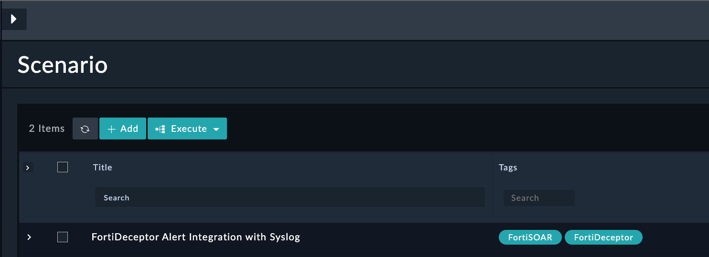
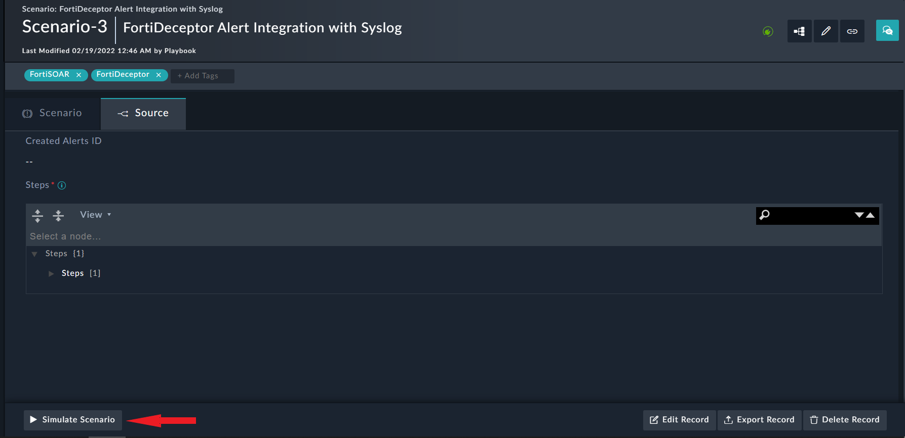
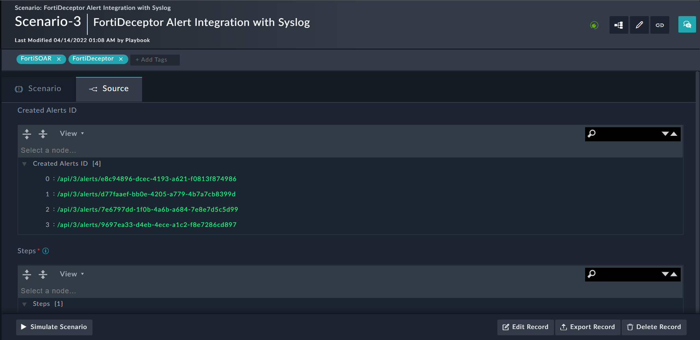

# Usage of Lateral Movement and VPN Breach Response Solution Pack

## Use Case Workflow

This solution pack contains two types of execution workflows

- Scenario-based Workflow
- Investigate Lateral Movement & VPN Breach Detection Workflow

### 1. Scenario-based Workflow

The scenario demonstrates and generates a demo alert for the Alert Type `Other / Unknown`

- The Scenario-based workflow follows the below pattern:
    1. Go to the `Simulations` menu in Navigation and choose Device `FortiDeceptor Alert Integration with Syslog` scenario
    

    2. Open a `FortiDeceptor Alert Integration with Syslog` scenario and Click on the `Simulate Scenario` button
    

    3. Demo record will be created for the scenario
    

    4. The created Alerts records IRI will be displayed in the Scenario record
    

### 2. Investigate Command & Control Response

- Refer to the below step to execute the use-case:

1. Open the “Other / Unknown” type alert in detail view, click on the execute button to execute the “Investigate Lateral Movement & VPN Breach Detection” use-case

